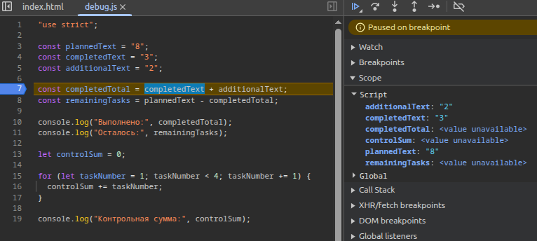

1 Автор и вариант: Романов Руслан; ЭФБО-14-25; Вариант 8    

2. Окружение: Ubuntu , версии Node.js:v24.21.0, npm: 11.19.0
 и Git: 2.53.0, Chrome.

3. Запуск: команды : node practice-01/js/hello.js
node practice-01/js/types.js
node practice-01/js/progress.js
node practice-01/js/plan.js
node practice-01/js/debug.js
Браузер: открыть practice-01/index.html, заменить путь в script на нужный файл, сохранить изменения, перезагрузить страницу и посмотреть Console. Все пять обязательных файлов должны работать в обоих окружениях; различие typeof document в первом задании ожидаемо.

4. Задание 1: 
Различие заключается в том, что в разных запусках программы, появляется разный тип переменной "докумет": если открывать в консоле браузера, то выдается тип object, если через консоль редактора кода - undefinded. Это происходит из-за того, что typeof зависит от среды выполнения. 

5. Задание 2:

| Выражение | Ожидание до запуска | Фактическое значение | Тип результата | Объяснение |
|---|---|---|---|---|
| "8" + 2 | 88 | 82 | String | + со строкой всегда приводит к конкатенации |
| "8" - 2 | -82 | 6 | Number | - всегда приводит к числу |
| Number("8") + 2 | 10 | 10 | Number | Из-за явного преобразования выводится число |
| "12" > "3" | True | False | Boolean | Из-за того, что сравнение идет по-символьно |
| 12 === "12" | False | False | Boolean | Тут сравнивается два разных типа данных |
| Number("") | 0 | 0 | Number | Пустая строка приравнивается к 0 |
| Number("text") | Nan | Nan | Number | Текст невозможно представить в виде числа |
| Boolean("false") | True | True | Boolean | Т.к. в boolean есть не пустая строка |
| typeof null | Null | Object | Object | Это особенность JS |
| typeof NaN | Number | Number | Number | Nan - это числовой тип |

6. Задания 3 и 4:

Таблица 1
| Проверка | Входные данные | Ожидаемый результат | Фактический результат | Итог |
|---|---|---|---|---|
| Обычный случай | 12 5 | Осталось 7; прогресс 41.7%; статус «В работе». | Осталось 7; прогресс 41.7%; статус «В работе». | Всего задач: 12 Выполнено: 5 Осталось: 7 Прогресс: 41.7% Статус: В работе |
| Обычный случай | 0 0 | Сообщение «Задач пока нет», без расчёта процента. | Сообщение «Задач пока нет», без расчёта процента. | Задач пока нет |
| Обычный случай | 5 0 | Осталось 5; прогресс 0.0%; статус «Не начато». | Осталось 5; прогресс 0.0%; статус «Не начато». | Всего задач: 5 Выполнено: 0 Осталось: 5 Прогресс: 0.0% Статус: Не начато |
| Обычный случай | 5 5  | Осталось 0; прогресс 100.0%; статус «Завершено». | Осталось 0; прогресс 100.0%; статус «Завершено». | Всего задач: 5 Выполнено: 5 Осталось: 0 Прогресс: 100.0% Статус: Завершенo |
| Некорректные данные | 5 6 | Ошибка: выполнено больше, чем существует. | Ошибка: выполнено больше, чем существует. | Ошибка: некорректные данные |
| Некорректные данные | -1 0 | Ошибка: отрицательное количество. | Ошибка: отрицательное количество. | Ошибка: некорректные данные |
| Некорректные данные | 5 2,5 | Ошибка: дробное количество. | Ошибка: дробное количество. | Ошибка: значения должны быть целыми числами |
| Некорректные данные | "5" 2 | Ошибка: вместо числа передана строка. | Ошибка: вместо числа передана строка. | Ошибка: значения должны быть целыми числами |
| Некорректные данные | 1001 0 | Ошибка: превышена верхняя граница. | Ошибка: превышена верхняя граница. | Ошибка: некорректные данные |
| Некорректные данные | Nan 0 | Ошибка: недопустимое числовое значение. | Ошибка: недопустимое числовое значение. | Nan is not defined |

Таблица 2
| Проверка | Входные данные | Ожидаемый результат | Фактический результат | Итог |
|---|---|---|---|---|
| Обычный случай |  12 5 | Осталось 7; прогресс 41.7%; статус «В работе» | Осталось 7; прогресс 41.7%; статус «В работе» | Всего задач: 12 Выполнено: 5 Осталось: 7 Прогресс: 41.7% Статус: В работе |
| Обычный случай | 0 0 | Сообщение «Задач пока нет», без расчёта процента | Сообщение «Задач пока нет», без расчёта процента | Задач пока нет |
| Обычный случай | 5 0 | Осталось 5; прогресс 0.0%; статус «Не начато» | Осталось 5; прогресс 0.0%; статус «Не начато» | Всего задач: 5 Выполнено: 0 Осталось: 5 Прогресс: 0.0% Статус: Не начато |
| Обычный случай | 5 5 | Осталось 0; прогресс 100.0%; статус «Завершено» | Осталось 0; прогресс 100.0%; статус «Завершено» | Всего задач: 5 Выполнено: 5 Осталось: 0 Прогресс: 100.0% Статус: Завершено |
| Некорректные данные | 5 6 | Сообщение : Ошибка: некорректные данные | Сообщение : Ошибка: некорректные данные | Ошибка: некорректные данные |
| Некорректные данные | -1 0 | Сообщение : Ошибка: некорректные данные | Сообщение : Ошибка: некорректные данные | Ошибка: некорректные данные |
| Некорректные данные | 5 2.5 | Сообщение : Ошибка: значения должны быть целыми числами | Сообщение : Ошибка: значения должны быть целыми числами | Ошибка: значения должны быть целыми числами |
| Некорректные данные | "5" 2 | Сообщение : Ошибка: значения должны быть целыми числами | Сообщение : Ошибка: значения должны быть целыми числами | Ошибка: значения должны быть целыми числами |
| Некорректные данные | 1001 0 | Сообщение : Ошибка: некорректные данные | Сообщение : Ошибка: некорректные данные | Ошибка: некорректные данные |
| Некорректные данные | Nan 0 | Ошибка | Ошибка | Nan is not defined |

7. Отладка:

| Ошибка | Что наблюдалось | Причина | Исправление | Результат после исправления |
|---|---|---|---|---|
| Обработка количества задач | completedTotal = "32" (строка), remainingTasks = -24 | Оператор + для строк выполняет конкатенацию,  а не сложение. "3"+"2" даёт "32". Затем "8"-"32"=-24 | Привести операнды к числу: Number(completedText)  + Number(additionalText) | completedTotal = 5  remainingTasks = 3 |
| Граница цикла | controlSum = 6 вместо 10, в Scope видно, что taskNumber доходит только до 3 | УсловиеtaskNumber < 4 останавливает цикл  до 4, поэтому 4 не прибавляется | Заменить < на <= в taskNumber | controlSum = 10 |

8. Вывод: В ходе практической работы я подготовил рабочее окружение (Node.js, npm, Git, VS Code, браузер),
освоил базовый цикл разработки на JavaScript: написал код, запустил его в двух средах,
проверил результат и сохранил изменения в Git.